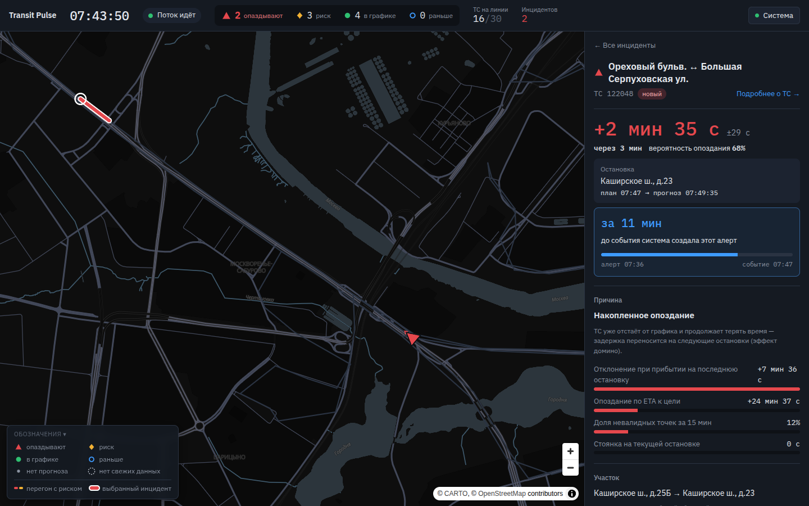

# Transit Pulse

Система раннего предупреждения о задержках городского транспорта. Она принимает поток телеметрии
NDTP, накладывает его на нитку графика, за **10–15 минут** до прибытия прогнозирует задержку ТС на
остановке и выводит алерт с причиной и рекомендациями на дашборд диспетчера.



Документация (Sphinx по коду + Swagger): [jinxovich.github.io/transit-pulse](https://jinxovich.github.io/transit-pulse/).
В запущенной системе — http://localhost:8000/code-docs/ (Sphinx), http://localhost:8000/docs и
http://localhost:8001/docs (Swagger); собрать сайт локально — `make docs-site`.

```
 replayer / эмулятор ──NDTP TCP──► backend :8000 (+ NDTP :9201) ──HTTP──► ml :8001
                                        │  REST /api/v1 + WebSocket
                                        ▼
                                  dashboard :8080
```

## Результаты

- Скор платформы **1.0** (максимум, 6 из 6) у всех ML-сабмитов, в том числе у v3 без
  синтетических клонов моментов validate — [SUBMISSIONS](docs/SUBMISSIONS.md).
- Честное CV (клоны validate отсечены ±45 мин): MAE **67 с** против **88 с** у baseline `cur_dev_s`.
- На потоке (NDTP → backend → ML, фолд-модели): честная MAE **78 с** против **93 с** у baseline;
  алерты — у 100% упреждение ≥ 10 мин, 85% опоздавших рейсов с алертом —
  [stream_eval](docs/perf/stream_eval.md), [PERFORMANCE](docs/PERFORMANCE.md).

## Запуск (Docker)

Нужны Docker с Compose v2, ≈4 ГБ диска под образы и интернет для первой сборки; первая сборка
занимает 1–3 мин в зависимости от сети (у нас из чистого клона: сборка без кэша слоёв — 64 с,
затем `up` со скачиванием датасета — 24 с).

1. Датасет: [disk.yandex.ru/d/CA6tsj4aJJ4Aaw](https://disk.yandex.ru/d/CA6tsj4aJJ4Aaw). Класть его
   не обязательно — `data-init` сам скачает `dataset.zip` (≈150 МБ, нужен интернет). Можно
   положить в `./data` архив (`Предиктор задержек транспорта.zip` или `dataset.zip`) или уже
   распакованную папку — тогда без сети.
2. Поднимите систему:

   ```bash
   docker compose up -d --build
   ```

   Сервис `data-init` найдёт или скачает датасет и разложит его в `./data/raw`, затем по
   healthcheck поднимутся `ml`, `backend`, `replayer` и `dashboard`. Replayer стартует автоматически: прогревает 30 сим-минут и
   проигрывает день 06.01.2026 с 07:00 в реальном времени.
3. Откройте дашборд: **http://localhost:8080**. ТС сразу движутся по карте, первые инциденты с
   упреждением 10–15 минут появляются через несколько минут. Чтобы не ждать, переключите скорость
   дня кнопками **×10 / ×30 / ×60** рядом с часами (там же пауза).

### Если что-то не поднялось

- **`data-init` завершился с ошибкой** — `docker compose logs data-init`. Обычно нет сети до
  Яндекс.Диска: скачайте архив по ссылке выше, положите в `./data` и повторите `docker compose up -d`.
- **Порт занят** — скопируйте `.env.example` в `.env` и поменяйте порт, например `DASHBOARD_PORT=8088`.
- **npm падает по таймауту при сборке дашборда** — соберите его через зеркало npm или с сетью хоста:

  ```bash
  docker compose build --build-arg NPM_REGISTRY=https://registry.npmmirror.com dashboard
  # или: docker build --network host -f dashboard/Dockerfile -t transit-pulse-dashboard .
  docker compose up -d
  ```

**Живой поток с официального эмулятора NDTP** (дополнительно):

```bash
docker load -i data/raw/ndtp-telemetry-emulator.tar
docker compose --profile emulator up -d
```

Борта эмулятора появятся на карте серыми как «неопознанные» (их нет в расписании), а на
`/api/v1/ingest/stats` будет виден последний раскодированный пакет (hex и поля).

## Что где смотреть

| Что | Где |
|---|---|
| Дашборд диспетчера | http://localhost:8080 |
| Метрики, качество на потоке, последний NDTP-пакет | кнопка «Система» на дашборде |
| Swagger backend (REST API) | http://localhost:8000/docs |
| Swagger ML-сервиса | http://localhost:8001/docs |
| Документация по коду (Sphinx) | http://localhost:8000/code-docs/ |
| Метрики Prometheus | http://localhost:8000/metrics, http://localhost:8001/metrics |
| Управление потоком (пауза, скорость, перемотка) | `POST /api/v1/replay/control`, статус — http://localhost:8090/status |

Подробный сценарий проверки — [docs/JURY_GUIDE.md](docs/JURY_GUIDE.md).

## Модули

| Модуль | Роль | Код |
|---|---|---|
| **backend** | Приём и парсинг NDTP (TCP :9201), состояние флота, сим-часы, сопоставление с расписанием, производные признаки (отклонение, скорость на перегоне, простой), оркестрация прогнозов, инциденты, REST и WebSocket | `services/backend` |
| **ml** | ML-ядро: обучение (CatBoost, CV; в Docker — сервис `train`, `docker compose --profile train run --rm train --refit`) и stateless-инференс `/predict` с квантилями, вероятностью опоздания и вкладами признаков; `POST /model/reload` подхватывает дообученные модели без рестарта | `services/ml` |
| **dashboard** | BI-дашборд диспетчера (React, MapLibre) | `dashboard` |
| replayer | Источник потока: проигрывает исторический день как NDTP-трафик | `services/replayer` |
| transit_core | Общее ядро: NDTP-кодек, расписание, признаки на момент T, стоп-детектор, причины, контракт API | `packages/transit_core` |

## Документы

- [JURY_GUIDE](docs/JURY_GUIDE.md) — как подать поток, где увидеть прогнозы, алерты и метрики.
- [PERFORMANCE](docs/PERFORMANCE.md) — латентность, пропускная способность, деградация, холодный старт.
- [FEATURES](docs/FEATURES.md) — реализованные дополнительные возможности.
- [DATA_AUDIT](docs/DATA_AUDIT.md) — аудит данных: найденная утечка и почему мы её не используем.
- [SUBMISSIONS](docs/SUBMISSIONS.md) — журнал сабмитов.
- [INTERFACES](docs/INTERFACES.md) — договор между модулями.

## Разработка без Docker

```bash
uv sync --all-groups                               # окружение Python 3.12+
uv run python -m scripts.data_prep                 # датасет в ./data/raw (архив, папка или скачать)
uv run pytest -q                                   # тесты
uv run ruff check                                  # линтер
uv run python -m services.ml.app.train             # CV и обучение моделей в ./models
uv run python -m scripts.make_submission           # сабмит по validate
node contracts/mock-server/server.mjs              # mock-backend для фронта на :8000
```
